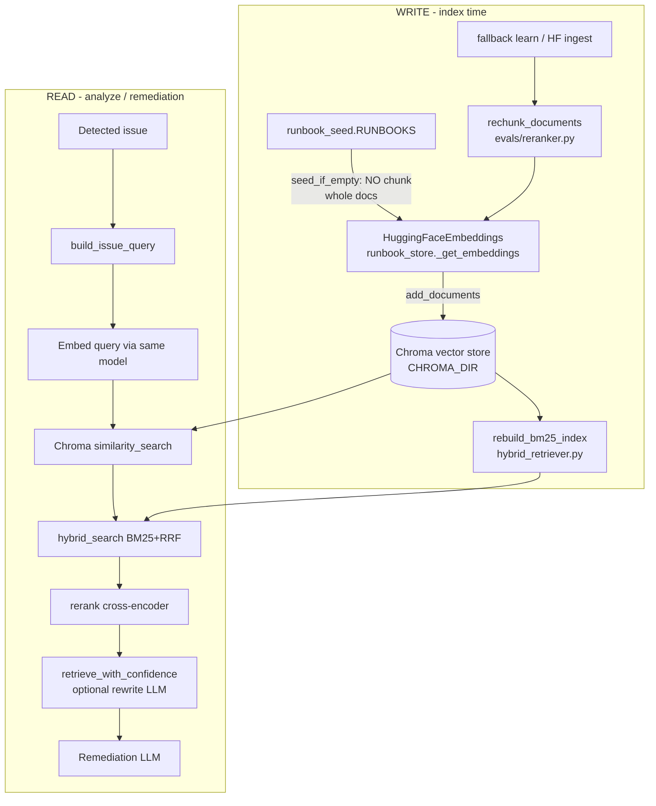

Here is the **full RAG pipeline** as implemented — write path vs read path.

---

## 1. Where things live

| Step | File | When |
|------|------|------|
| **Corpus source** | [`backend/app/knowledge/runbook_seed.py`](backend/app/knowledge/runbook_seed.py) | Curated runbooks in code |
| **Chunking** | [`backend/app/evals/reranker.py`](backend/app/evals/reranker.py) → `rechunk_documents` | Size 500 / overlap 50 (`RAG_CHUNK_*`) |
| **Called via** | [`runbook_store.add_documents_chunked`](backend/app/knowledge/runbook_store.py) | Fallback learn / HF ingest |
| **Embedding model** | [`runbook_store._get_embeddings`](backend/app/knowledge/runbook_store.py) | `sentence-transformers/all-MiniLM-L6-v2` (local) or HF Inference API if `HF_TOKEN` |
| **Vector store** | Chroma `collection_name="runbooks"` | Disk: `CHROMA_DIR` (usually `backend/chroma_db`) |
| **Lexical index** | [`hybrid_retriever.rebuild_bm25_index`](backend/app/knowledge/hybrid_retriever.py) | After every seed/add |
| **Query build** | [`query_builder.py`](backend/app/knowledge/query_builder.py) | Remediator per issue |
| **Retrieve** | [`retrieve_with_scores`](backend/app/knowledge/runbook_store.py) | Vector → hybrid → rerank |
| **Confidence / rewrite** | [`confidence.py`](backend/app/knowledge/confidence.py) | Low score → rewrite query → retrieve again |
| **Used by** | [`remediation_node`](backend/app/nodes/remediation.py) | Analyze graph |
| **Learn on miss** | [`fallback.py`](backend/app/nodes/fallback.py) → `add_new_issue_to_store` → **chunked** add | KB MISS path |

---

## 2. Write path (indexing)

### A. Startup seed (`seed_if_empty` in `main.py` lifespan)

1. Load `RUNBOOKS` from seed file  
2. **No chunking** — each runbook is one document if short enough as authored  
3. `store.add_documents(docs)` → Chroma **embeds each doc** via `embedding_function` and **stores vectors + text** on disk  
4. `_rebuild_bm25_index` → in-memory BM25 over the same corpus  

### B. Learn / HF ingest (`add_documents_chunked`)

1. New doc (learned runbook or HF text)  
2. **`rechunk_documents`** if longer than `RAG_CHUNK_SIZE`  
3. **Embed + store** each chunk in Chroma  
4. Rebuild BM25  

---

## 3. Read path (during analyze)

Triggered in **remediation** (not on every log line):

1. Classifier → list of **issues**  
2. For each issue (top 3 by severity):  
   - `build_issue_query` + optional metadata filters  
   - **Embed the query** (same embedding model)  
   - Chroma **`similarity_search`** → vector candidates  
   - **Hybrid** BM25 + RRF merge  
   - **Rerank** (cross-encoder) → top-k  
   - If confidence low → **LLM rewrite query** → retrieve again  
3. Concatenate retrieved runbook text  
4. **One remediation LLM** call grounded on that context  

Uploaded **log files are not chunked into Chroma**. Only the **runbook knowledge base** is vector-indexed. Logs go through the classifier; RAG retrieves runbooks for those issues.

---

## 4. One-line map

| Concept | Happens? | Where |
|---------|----------|--------|
| Chunking | Yes, on **learn/HF ingest**; **not** on seed or log upload | `rechunk_documents` |
| Embedding | Yes, on write (docs) and read (query) | `_get_embeddings` + Chroma |
| Vector store | Yes | Chroma → `./chroma_db` |
| Indexing (vector) | Yes | `add_documents` |
| Indexing (keyword) | Yes | BM25 rebuild |
| Hybrid retrieve | Yes | `hybrid_search` |
| Rerank | Yes | `rerank` in retrieve path |
| Confidence rewrite | Yes | `retrieve_with_confidence` |

That’s the entire RAG loop in this repo.
